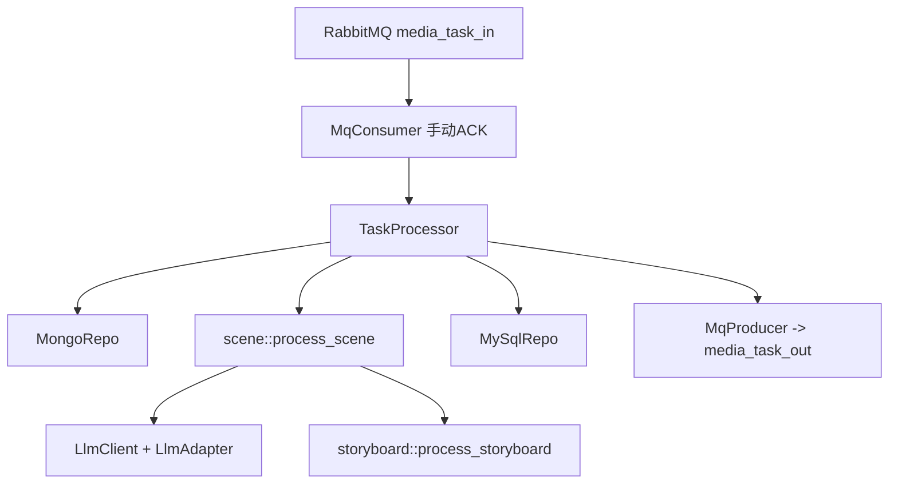

# Media Prompt 生成微服务 - 设计评审稿（签名级）

## 1. 阶段目标与边界

本稿件用于**设计评审阶段（阶段 1）**，仅提供：

1. 模块划分与文件结构
2. 关键数据流与失败策略
3. 关键函数签名（Rust）

本稿件刻意不包含：

1. 业务实现细节
2. 具体 SQL 语句与 HTTP 处理逻辑
3. 完整可运行代码片段

评审通过后，再进入阶段 2（按签名落实现）。

## 2. 模块文件结构

```text
backend/src/
├── main.rs                  # 启动、健康检查、指标端点、信号处理
├── config.rs                # YAML 配置加载与校验
├── error.rs                 # 统一错误类型
├── db/
│   ├── mod.rs
│   ├── mongo.rs             # MongoRepo
│   └── mysql.rs             # MySqlRepo
├── mq/
│   ├── mod.rs
│   ├── consumer.rs          # MqConsumer（重连与并发消费）
│   └── producer.rs          # MqProducer（下游投递）
├── llm/
│   ├── mod.rs
│   ├── types.rs             # PromptContext / LlmAdapter / DTO
│   └── client.rs            # LlmClient（重试、限流、适配器分发）
├── task/
│   ├── mod.rs
│   ├── processor.rs         # TaskProcessor（端到端编排）
│   ├── scene.rs             # 场级处理
│   └── storyboard.rs        # 分镜状态机
└── model/
    ├── mod.rs
    ├── script.rs            # 剧本模型
    └── prompt.rs            # 提示词模型
```

## 3. 核心流程（评审视图）



失败策略（仅规则）：

1. 场级（`video_prompt` / `multi_view_prompt`）失败：任务失败，NACK（`requeue=false`）。
2. 分镜级失败：该分镜短路后续 prompt，记录已成功项与错误信息。
3. 对写入 MySQL 的 LLM 失败记录，至少保留 `error_message`、`llm_error_code`、`llm_response_snippet`、`llm_retries`，支持事后排障与运营观测。

## 4. 关键函数签名（按模块）

### 4.1 配置模块 `config.rs`

```rust
#[derive(Debug, Deserialize, Clone)]
pub struct AppConfig {
    pub rabbitmq: RabbitMqConfig,
    pub mongodb: MongoDbConfig,
    pub mysql: MySqlConfig,
    pub llm: LlmConfig,
    pub concurrency: ConcurrencyConfig,
    pub server: ServerConfig,
}

impl AppConfig {
    pub async fn load<P: AsRef<Path>>(path: P) -> Result<Self, AppError>;
}
```

```rust
#[derive(Debug, Deserialize, Clone)]
pub struct RabbitMqConfig {
    pub uri: String,
    pub consume_queue: String,
    pub publish_queue: String,
    pub prefetch_count: u16,
    pub reconnect_initial_delay_ms: u64,
    pub reconnect_max_delay_ms: u64,
}

#[derive(Debug, Deserialize, Clone)]
pub struct LlmConfig {
    pub provider: String,
    pub base_url: String,
    pub model: String,
    pub api_key: String,
    pub allow_empty_api_key: bool,
    pub timeout_secs: u64,
    pub max_retries: u32,
}
```

### 4.2 消息队列模块 `mq/*`

```rust
pub struct MqConsumer { /* ... */ }

impl MqConsumer {
    pub fn new(
        config: RabbitMqConfig,
        task_semaphore: Arc<Semaphore>,
        shutdown_rx: watch::Receiver<bool>,
        processor: Arc<TaskProcessor>,
    ) -> Self;

    pub async fn run(&self) -> Result<(), AppError>;
}
```

```rust
#[derive(Clone)]
pub struct MqProducer { /* ... */ }

impl MqProducer {
    pub async fn connect(config: &RabbitMqConfig) -> Result<Self, AppError>;
    pub async fn publish_completion(&self, task_id: i64) -> Result<(), AppError>;
    pub async fn check_publish_queue(&self) -> Result<(), AppError>;
}
```

### 4.3 数据访问模块 `db/*`

```rust
#[derive(Clone)]
pub struct MongoRepo { /* ... */ }

impl MongoRepo {
    pub async fn connect(config: &MongoDbConfig) -> Result<Self, AppError>;
    pub async fn find_script_by_task_id(&self, task_id: i64) -> Result<ScriptDocument, AppError>;
    pub async fn ping(&self) -> Result<(), AppError>;
}
```

```rust
#[derive(Clone)]
pub struct MySqlRepo { /* ... */ }

impl MySqlRepo {
    pub async fn connect(config: &MySqlConfig) -> Result<Self, AppError>;
    pub async fn batch_insert_prompts(&self, prompts: &[MediaPrompt]) -> Result<(), AppError>;
    pub async fn ping(&self) -> Result<(), AppError>;
}
```

### 4.4 LLM 模块 `llm/*`

```rust
pub const PROVIDER_OPENAI_COMPATIBLE: &str = "openai_compatible";
pub const PROVIDER_SIMPLE_TEXT_JSON: &str = "simple_text_json";

pub fn supported_llm_providers() -> &'static [&'static str];
```

```rust
pub trait LlmAdapter: Send + Sync {
    fn provider(&self) -> &'static str;
    fn build_request(&self, config: &LlmConfig, ctx: &PromptContext) -> serde_json::Value;
    fn parse_response(
        &self,
        body_text: &str,
        status: u16,
    ) -> Result<ParsedLlmResponse, LlmError>;
}
```

```rust
#[derive(Clone)]
pub struct LlmClient { /* ... */ }

impl LlmClient {
    pub fn new(config: LlmConfig, semaphore: Arc<Semaphore>) -> Result<Self, AppError>;
    pub async fn generate(&self, ctx: &PromptContext) -> Result<LlmResult, AppError>;
}
```

### 4.5 任务编排模块 `task/*`

```rust
pub struct TaskProcessor { /* ... */ }

impl TaskProcessor {
    pub fn new(
        mongo: MongoRepo,
        mysql: MySqlRepo,
        llm_client: LlmClient,
        producer: MqProducer,
    ) -> Self;

    pub async fn process(&self, msg: TaskMessage) -> Result<(), AppError>;
}
```

```rust
pub struct SceneResult { /* ... */ }

pub async fn process_scene(
    llm_client: &LlmClient,
    task_id: i64,
    scene: &Scene,
) -> Result<SceneResult, AppError>;
```

```rust
pub struct StoryboardResult { /* ... */ }

pub async fn process_storyboard(
    llm_client: &LlmClient,
    task_id: i64,
    scene_index: i32,
    storyboard: &Storyboard,
    scene_description: &str,
    video_prompt: &str,
    multi_view_prompt: &str,
) -> StoryboardResult;
```

### 4.6 服务入口模块 `main.rs`

```rust
#[tokio::main]
async fn main();

async fn run() -> Result<(), Box<dyn std::error::Error>>;
```

```rust
async fn run_health_server(
    port: u16,
    state: Arc<HealthState>,
    shutdown_rx: watch::Receiver<bool>,
);

async fn handle_health_connection(
    stream: tokio::net::TcpStream,
    state: Arc<HealthState>,
);

async fn shutdown_signal();
```

说明：当前健康检查端点可先维持轻量实现；后续可在不改变 API 语义的前提下迁移到 `hyper/axum`，降低自定义 HTTP 解析维护成本并增强中间件扩展性。

## 5. 配置项（评审最小集）

```yaml
rabbitmq:
  uri: String
  consume_queue: String
  publish_queue: String
  prefetch_count: u16
  reconnect_initial_delay_ms: u64
  reconnect_max_delay_ms: u64

mongodb:
  uri: String
  database: String
  collection: String

mysql:
  url: String
  max_connections: u32

llm:
  provider: "openai_compatible" | "simple_text_json"
  base_url: String
  model: String
  api_key: String
  allow_empty_api_key: bool
  timeout_secs: u64
  max_retries: u32

concurrency:
  max_tasks: usize
  max_llm_requests: usize

server:
  health_port: u16
```

## 6. 评审确认清单（需先达成一致）

1. 是否确认以上模块边界与文件布局。
2. 是否确认上述签名作为阶段 2 的实现基线。
3. 是否确认失败策略与重试策略（场级失败即任务失败，分镜失败短路）。
4. 是否确认默认 provider 与 demo/production 配置切换规则。
5. 通过后才进入“提交完整实现代码”阶段。
