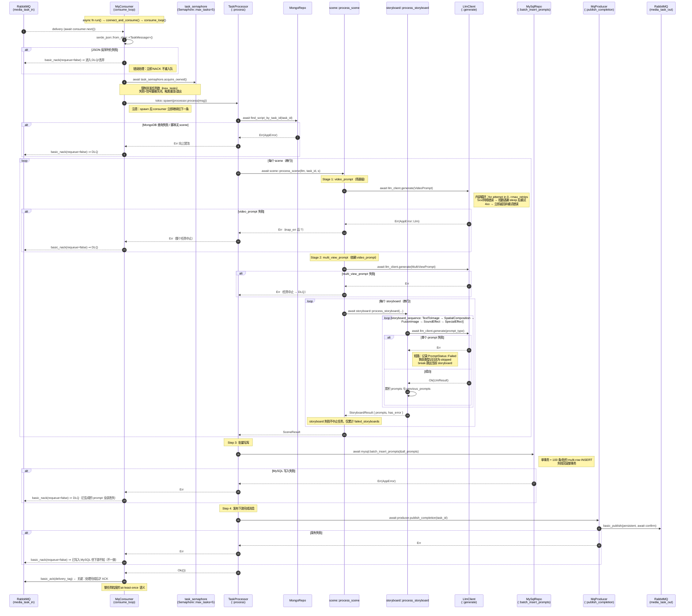

# Media Prompt 生成微服务 — 异步处理链路与可靠性分析

> 本分析基于实际代码（[main.rs](file:///Users/huwenjie/项目/gsb/label-02784/backend/src/main.rs)、[task/processor.rs](file:///Users/huwenjie/项目/gsb/label-02784/backend/src/task/processor.rs)、[task/scene.rs](file:///Users/huwenjie/项目/gsb/label-02784/backend/src/task/scene.rs)、[task/storyboard.rs](file:///Users/huwenjie/项目/gsb/label-02784/backend/src/task/storyboard.rs)、[mq/consumer.rs](file:///Users/huwenjie/项目/gsb/label-02784/backend/src/mq/consumer.rs)、[mq/producer.rs](file:///Users/huwenjie/项目/gsb/label-02784/backend/src/mq/producer.rs)、[llm/client.rs](file:///Users/huwenjie/项目/gsb/label-02784/backend/src/llm/client.rs)、[db/mysql.rs](file:///Users/huwenjie/项目/gsb/label-02784/backend/src/db/mysql.rs)、[model/prompt.rs](file:///Users/huwenjie/项目/gsb/label-02784/backend/src/model/prompt.rs)）。

---

## 一、从 RabbitMQ 入队到 MySQL 落盘的完整异步处理链路

下图覆盖了消费者 [`MqConsumer::consume_loop`](file:///Users/huwenjie/项目/gsb/label-02784/backend/src/mq/consumer.rs#L161-L254) 接收一条任务，到 [`TaskProcessor::process`](file:///Users/huwenjie/项目/gsb/label-02784/backend/src/task/processor.rs#L41-L104) 内部分阶段处理直至最终批量写入 MySQL 并发布下游完成消息的全过程。每条 `await` 点和错误处理策略都已在图中标注。



### 关键 async 函数与 await 点速查

| 阶段 | 入口 | 关键 await | 错误策略 |
|------|------|-----------|---------|
| 拉取消息 | [`consumer.next()`](file:///Users/huwenjie/项目/gsb/label-02784/backend/src/mq/consumer.rs#L173) | `delivery = consumer.next().await` | 流错误 → 重连（指数退避） |
| 反序列化 | `serde_json::from_slice` | 同步 | NACK 不重入队 |
| 并发限流 | [`acquire_owned()`](file:///Users/huwenjie/项目/gsb/label-02784/backend/src/mq/consumer.rs#L193) | `await` | 信号量关闭 → 退出/重连 |
| 任务执行 | [`processor.process`](file:///Users/huwenjie/项目/gsb/label-02784/backend/src/task/processor.rs#L41) | `tokio::spawn` 内 `await` | Err → NACK 不重入队 |
| MongoDB 读 | `find_script_by_task_id` | `await` | 任务整体失败 |
| LLM 调用 | [`LlmClient::generate`](file:///Users/huwenjie/项目/gsb/label-02784/backend/src/llm/client.rs#L51) | `acquire().await`、`do_request().await`、`tokio::time::sleep().await` | 5xx/网络重试，4xx 不重试 |
| MySQL 批写 | [`batch_insert_prompts`](file:///Users/huwenjie/项目/gsb/label-02784/backend/src/db/mysql.rs#L31) | `pool.begin().await`、`query.execute().await`、`tx.commit().await` | 失败回滚整事务 |
| 下游发布 | [`publish_completion`](file:///Users/huwenjie/项目/gsb/label-02784/backend/src/mq/producer.rs#L45) | `basic_publish().await?.await?` | 失败任务整体失败 |
| ACK | `basic_ack(tag)` | `await` | 仅在 process Ok 后才 ACK |

---

## 二、提示词依赖顺序的实现方式

### 实际实现：纯串行管道（pipeline），非 DAG，非并行

整个生成流程在三个层级上都是**严格的 for 循环串行**，没有用到 `tokio::join!` / `try_join_all` / `JoinSet` 等并行原语：

1. **任务层** — [`processor.rs#L64-L69`](file:///Users/huwenjie/项目/gsb/label-02784/backend/src/task/processor.rs#L64-L69)：`for s in &script.scenes` 顺序处理每个 scene。
2. **场景层** — [`scene.rs`](file:///Users/huwenjie/项目/gsb/label-02784/backend/src/task/scene.rs#L34-L100)：先 `video_prompt`，再 `multi_view_prompt`（且后者通过 `vp_ctx → mvp_ctx.video_prompt = Some(...)` 形成数据依赖）；之后 `for sb in &scene.storyboards` 串行处理每个分镜。
3. **分镜层** — [`storyboard.rs#L40-L115`](file:///Users/huwenjie/项目/gsb/label-02784/backend/src/task/storyboard.rs#L40-L115)：按 [`PromptType::storyboard_sequence()`](file:///Users/huwenjie/项目/gsb/label-02784/backend/src/model/prompt.rs#L31-L39) 定义的固定顺序  
   `TextToImage → SpatialCompositionDrawing → FusionImage → SoundEffect → SpecialEffect`  
   逐个生成；并通过 `previous_prompts: Vec<(PromptType, String)>` 把前一个的结果累计传给后一个的上下文。

数据流如下：

```
video_prompt ──▶ multi_view_prompt ──▶ storyboard[i] {
    text_to_image ──▶ spatial_composition_drawing
                  ──▶ fusion_image
                  ──▶ sound_effect
                  ──▶ special_effect
}
```

这是一种"上下文累积 + 严格串行"的管道（context-accumulating pipeline），每一步都把前面的所有产物作为下一步的 prompt context 之一。

### 失败影响：分两层不同语义

| 失败位置 | 影响范围 | 行为 |
|---------|---------|------|
| `video_prompt` / `multi_view_prompt`（场景级） | **整个任务终止** | [`scene.rs#L48`](file:///Users/huwenjie/项目/gsb/label-02784/backend/src/task/scene.rs#L48) 与 [`#L82`](file:///Users/huwenjie/项目/gsb/label-02784/backend/src/task/scene.rs#L82) 用 `?` 直接向上抛错；最终 NACK 进 DLQ；**所有已生成的 prompt 全部丢失（未写库）**。 |
| `storyboard_sequence` 中任意一个 | **当前 storyboard 后续 prompt 短路** | [`storyboard.rs#L75-L113`](file:///Users/huwenjie/项目/gsb/label-02784/backend/src/task/storyboard.rs#L75-L113)：写入一条 `PromptStatus::Failed`，剩余类型只记 `warn!("Skipped due to prior failure")` 但**不写库**；`break` 后仍继续下一个 storyboard。任务最终仍 commit + ACK。 |

### 设计的优缺点

**优点**
- 实现极简：单线程语义、无锁、无并发协调，便于推理与 debug。
- 上下文显式传递（`previous_prompts`），后一个 prompt 能利用前一个的输出，质量更可控。
- 分镜级失败短路，避免在已知会失败的上下文上继续浪费 LLM 配额。
- 场景级失败即时中止，避免存入"半成品"。

**缺点**
- **吞吐性能差**：所有 LLM 调用串行排队；即便 [config.yaml](file:///Users/huwenjie/项目/gsb/label-02784/backend/config/config.yaml#L29) 中 `max_llm_requests=10`，单个任务内部根本无法填满该并发预算。多个 storyboard 之间没有真正的依赖（它们都只依赖场景级的两个 prompt），完全可以并行。
- **失败语义不一致**：场景级一失败整任务清空进 DLQ，但 storyboard 级失败却被"记录后跳过"。同样是依赖关系破坏，处理策略不统一，运维侧难以制定告警与补偿规则。
- **短路被记日志却不落库**：跳过的 prompt 类型只输出 `warn!`，MySQL 中不会留下"被跳过"的明确记录，下游无法区分"未生成"与"未尝试"。
- **DAG 表达力丢失**：当前代码把"先后顺序"硬编码在 `storyboard_sequence()` 数组里，未来若新增类型/关系（例如 `sound_effect` 不依赖 `fusion_image`）将不得不修改顺序常量并破坏所有上游假设。

---

## 三、可靠性风险分析

### (a) RabbitMQ 消息确认时机

**实际行为：处理完成后才 ACK / NACK（at-least-once）**

[mq/consumer.rs#L210-L231](file:///Users/huwenjie/项目/gsb/label-02784/backend/src/mq/consumer.rs#L210-L231) 中，在 `tokio::spawn` 出来的 task 内部调用 `processor.process(...).await`，根据返回值再 `basic_ack` 或 `basic_nack(requeue=false)`，且消费时配置 `no_ack: false`、`prefetch_count = 10`（[config.yaml#L5](file:///Users/huwenjie/项目/gsb/label-02784/backend/config/config.yaml#L5)）。

**根因分析**
- 时机基本正确：成功时 ACK，失败时 NACK 不重入队（即丢入 DLX/丢弃）。
- 然而 NACK 时直接 `requeue=false`，**没有任何任务级重试**：哪怕错误是瞬时的（如 MongoDB 短暂抖动、RabbitMQ 发布失败），整个任务也会立即被丢弃。
- 进程崩溃场景：因为 `no_ack=false`，未 ACK 的消息会被 broker 重投——**at-least-once 语义生效**，但任务处理本身**不是幂等的**（见 (c)）。
- 没有显式声明 dead-letter exchange / queue：[consumer.rs#L101-L110](file:///Users/huwenjie/项目/gsb/label-02784/backend/src/mq/consumer.rs#L101-L110) 仅 `queue_declare` 了 `media_task_in` 主队列，没有任何 `x-dead-letter-exchange` 参数。所以"丢入 DLQ"实际上**取决于 broker 端是否被运维额外配置过**——如果未配置，被 NACK 的消息直接消失。
- JSON 反序列化错误也走 `requeue=false`（[#L184-L187](file:///Users/huwenjie/项目/gsb/label-02784/backend/src/mq/consumer.rs#L184-L187)），合理；但同样依赖外部 DLQ 配置。

**改进方案**
1. 在 `queue_declare` 时显式带 `x-dead-letter-exchange` / `x-dead-letter-routing-key` 参数声明 DLQ，避免依赖外部约定。
2. 区分错误类型：对瞬时错误（DB 短暂不可用、网络抖动、RabbitMQ 发布失败）使用 `requeue=true` 或自带的 retry-with-delay 策略（结合 `x-message-ttl` + DLX 跳板做延时重试），对真正不可恢复错误才进 DLQ。
3. 在消息 header 中维护 `x-retry-count`，达到上限再进 DLQ。
4. 对 `process` 整体增加 `tokio::time::timeout`，防止单条消息因下游卡死永远占用一个 prefetch 槽位。

### (b) LLM API 调用超时与重试策略

**实际行为**：[llm/client.rs#L29-L32](file:///Users/huwenjie/项目/gsb/label-02784/backend/src/llm/client.rs#L29-L32) 在 reqwest 客户端层设置 `timeout = config.timeout_secs`（[config.yaml](file:///Users/huwenjie/项目/gsb/label-02784/backend/config/config.yaml#L24) 默认 `120s`）；[#L64-L75](file:///Users/huwenjie/项目/gsb/label-02784/backend/src/llm/client.rs#L64-L75) 实现重试循环：`for attempt in 0..=max_retries`（默认 3，共最多 4 次），退避公式 `1000ms * 2^(attempt-1)`，即 1s → 2s → 4s。失败分类：4xx 非重试（[#L203-L210](file:///Users/huwenjie/项目/gsb/label-02784/backend/src/llm/client.rs#L203-L210)），5xx / 网络错误可重试（[#L211-L219](file:///Users/huwenjie/项目/gsb/label-02784/backend/src/llm/client.rs#L211-L219)）。

**根因分析（不合理之处）**
1. **总耗时无上限**：单次请求 120s，重试 3 次最差 `120*4 + 1+2+4 = 487s`，再加上一个 scene 内可能数十次 LLM 调用，单任务可能超过 1 小时。这时 RabbitMQ 的 consumer timeout / heartbeat 极可能已经把 channel 断开（lapin 默认 heartbeat 是 60s，broker 端 consumer ack timeout 默认 30 分钟），导致前面 ACK 失败、消息被重投，但任务结果可能已经写库——**直接产生重复执行**（见 (c)）。
2. **重试无 jitter**：纯指数退避 `2^n`，多个并发任务在同一个 LLM 限流窗口下会同步触发重试，雷霆收敛（thundering herd）放大下游压力。
3. **重试粒度过粗**：`429 Too Many Requests` 属于 4xx，会被判为非重试（[#L203](file:///Users/huwenjie/项目/gsb/label-02784/backend/src/llm/client.rs#L203)）；但实际上 429 是典型的应当退避重试的状态码，且 OpenAI/Anthropic 等会返回 `Retry-After`。
4. **超时与场景级失败语义耦合过强**：120s 单次超时会被当成可重试的网络错误（`reqwest::Error::is_timeout`），看似合理，但实际触发后还会再串行重试 3 次，把任务时间拉爆。
5. **无熔断**：连续失败不会标记上游不可用；下一条任务进来会继续打满 LLM、继续等 487s。

**改进方案**
1. 引入**任务级超时预算**（例如 `process()` 外包 `tokio::time::timeout(task_budget)`），避免单条消息无限期占用 prefetch。
2. 重试退避加入 jitter（`backoff = base * 2^n * rand(0.5, 1.5)`），并引入上限封顶（如最多 30s 单次退避）。
3. 把 `429` 单独分类为可重试，并解析 `Retry-After` header 决定 sleep 时长。
4. 区分**单次 HTTP 超时**（应较短，例如 30s）与**单个 prompt 总耗时预算**（应有兜底）。
5. 加入**断路器（circuit breaker）**：连续 N 次失败后短时间直接 fast-fail，给上游降压。
6. 重试时复用同一个 `_permit`（当前实现已经是这样），但建议在 sleep 期间释放 permit，避免重试占用并发额度。

### (c) MySQL 写入失败时的消息丢失/重复处理风险

**实际行为**：[`batch_insert_prompts`](file:///Users/huwenjie/项目/gsb/label-02784/backend/src/db/mysql.rs#L31-L92) 在单事务里写完所有 prompt（chunks of 100）；写入失败 `?` 向上抛 → [`processor.rs#L79-L85`](file:///Users/huwenjie/项目/gsb/label-02784/backend/src/task/processor.rs#L79-L85) 抛错 → consumer 端 NACK(requeue=false)。

**根因分析（关键风险）**

1. **MySQL 失败 → 消息进 DLQ → 全部生成结果丢失**  
   任务跑完所有 LLM 调用（耗时长、Token 成本高），在最后一刻 MySQL commit 失败，结果是：消息被 NACK 不重入队，**已经付费消费过的所有 LLM 输出全部蒸发**。可观测性也很差——只有 [`processor.rs#L83`](file:///Users/huwenjie/项目/gsb/label-02784/backend/src/task/processor.rs#L83) 的一条 error 日志。

2. **下游发布失败 → 数据已落库但 ACK 失败 → 重复处理**  
   假设 [`mysql.batch_insert_prompts`](file:///Users/huwenjie/项目/gsb/label-02784/backend/src/db/mysql.rs#L76) 已 `tx.commit()`，紧接着 [`producer.publish_completion`](file:///Users/huwenjie/项目/gsb/label-02784/backend/src/mq/producer.rs#L45) 失败 → `process()` 返回 Err → consumer NACK 不重入队。**MySQL 已写、下游未通知**，整个流水线进入不一致状态。

3. **ACK 失败 / 进程崩溃 → 重复消费 → 重复写入**  
   [`processor.rs#L79`](file:///Users/huwenjie/项目/gsb/label-02784/backend/src/task/processor.rs#L79) 写完 MySQL，但还没来得及 ACK 时进程崩溃 / TCP 断开，broker 重投该消息：再次执行整个任务、再次写库。**`tb_media_prompt` 表 schema 没有 `(task_id, scene_index, storyboard_index, prompt_type)` 唯一约束**（参考 [schema.sql](file:///Users/huwenjie/项目/gsb/label-02784/backend/sql/schema.sql)），重复 INSERT 会成功 → 数据出现 N 条重复行；同时再发一次 completion 消息给下游。

4. **没有幂等键 / 没有事务包裹"写库 + 发消息"**  
   即便加了唯一约束，MySQL 提交和 RabbitMQ 发布也不在同一事务里（事实上做不到），需要 outbox 模式才能保证一致。

**改进方案**

1. **加幂等约束**：在 `tb_media_prompt` 上建立 `UNIQUE KEY uk_task_prompt (task_id, scene_index, storyboard_index, prompt_type)`，写入用 `INSERT ... ON DUPLICATE KEY UPDATE` 或 `INSERT IGNORE`，让重复消费天然幂等。
2. **采用 transactional outbox 模式**：完成消息记录到 MySQL 同一事务里的 `tb_outbox` 表，由一个独立的 publisher 进程从 outbox 读取并发布到 `media_task_out`。这样消除"写库 ↔ 发消息"双写不一致。
3. **任务级幂等检查**：处理任务一进来先按 `task_id` 查 `tb_media_prompt`，已存在视情况跳过 LLM 直接重发完成消息（适合"已写库 + 发消息失败"的重投场景）。
4. **MySQL 失败时的补偿**：考虑把 LLM 输出先落到便宜的存储（如 MongoDB、Redis、对象存储）作为"暂存盘"；MySQL 写入失败可重新触发"只补写库"的轻量任务，避免重新跑 LLM。
5. **细化错误码后再决定 NACK 行为**：MySQL 瞬时错误（连接断开、死锁回滚）应允许 broker 重投或走重试 DLX；schema 类错误才直接进 DLQ。
6. **消费链路上加 `task_id` 去重表**（distributed lock / `INSERT IGNORE INTO tb_task_lease`），保证同一 `task_id` 在同一时间只有一个消费者实例处理。

---

## 总结

- **链路骨架清晰**：消费者 → 信号量限流 → spawn task → MongoDB 读 → 串行场景/分镜 LLM 调用 → MySQL 单事务批写 → 发布完成 → ACK，整体是 at-least-once 模型。
- **依赖关系是固定的串行管道**，分镜级失败软跳过、场景级失败硬终止；缺乏并行度与统一的失败语义。
- **三大可靠性风险**主要集中在 `requeue=false + 无幂等保证 + 双写不一致`：成本高、状态弱一致；建议优先落地 **幂等唯一键** + **outbox** + **细粒度错误分类重试** 三件事。
