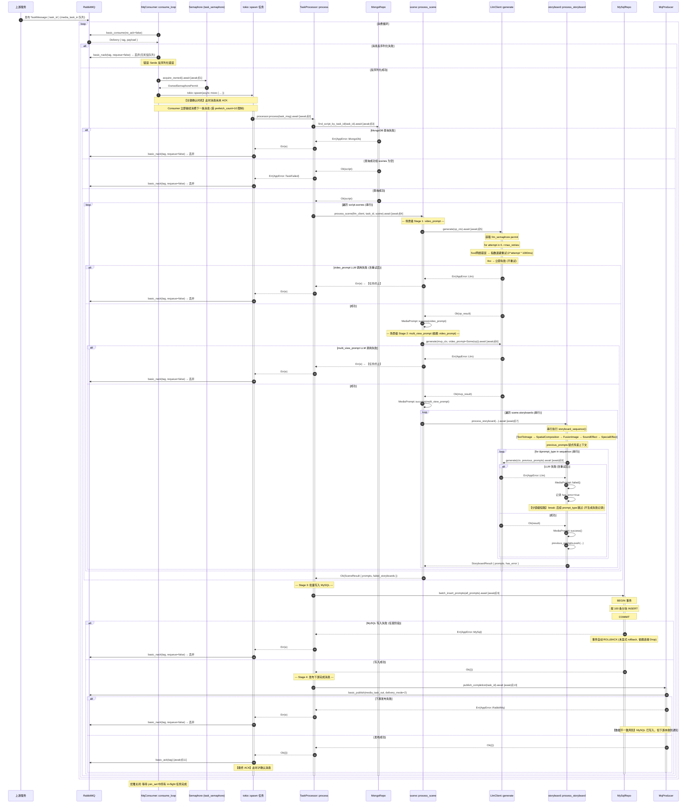

# Media Prompt 生成微服务代码分析报告

---

## 一、异步处理链路完整梳理

### 1.1 端到端处理时序图

基于对代码的完整分析，以下是从 RabbitMQ 消息入队到 MySQL 写入完成的完整异步处理链路：



### 1.2 关键 async 函数与 await 点索引

| 位置 | async 函数 | await 点 | 说明 |
|------|-----------|---------|------|
| [consumer.rs:193](file:///Users/huwenjie/项目/gsb/label-02784/backend/src/mq/consumer.rs#L193) | `consume_loop` | `acquire_owned().await` | 获取任务并发许可 |
| [consumer.rs:214](file:///Users/huwenjie/项目/gsb/label-02784/backend/src/mq/consumer.rs#L214) | spawned task | `processor.process().await` | 执行完整任务处理 |
| [processor.rs:46](file:///Users/huwenjie/项目/gsb/label-02784/backend/src/task/processor.rs#L46) | `process` | `mongo.find_script_by_task_id().await` | MongoDB 读取脚本 |
| [processor.rs:65](file:///Users/huwenjie/项目/gsb/label-02784/backend/src/task/processor.rs#L65) | `process` | `scene::process_scene().await` | 串行处理每个场景 |
| [scene.rs:48](file:///Users/huwenjie/项目/gsb/label-02784/backend/src/task/scene.rs#L48) | `process_scene` | `llm_client.generate().await` | 生成 video_prompt |
| [scene.rs:82](file:///Users/huwenjie/项目/gsb/label-02784/backend/src/task/scene.rs#L82) | `process_scene` | `llm_client.generate().await` | 生成 multi_view_prompt |
| [scene.rs:113](file:///Users/huwenjie/项目/gsb/label-02784/backend/src/task/scene.rs#L113) | `process_scene` | `storyboard::process_storyboard().await` | 处理每个分镜 |
| [storyboard.rs:52](file:///Users/huwenjie/项目/gsb/label-02784/backend/src/task/storyboard.rs#L52) | `process_storyboard` | `llm_client.generate().await` | 生成各分镜级提示词 |
| [llm/client.rs:52-56](file:///Users/huwenjie/项目/gsb/label-02784/backend/src/llm/client.rs#L52-L56) | `generate` | `semaphore.acquire().await` | 获取 LLM 并发许可 |
| [llm/client.rs:73](file:///Users/huwenjie/项目/gsb/label-02784/backend/src/llm/client.rs#L73) | `generate` | `tokio::time::sleep(backoff).await` | 重试退避等待 |
| [llm/client.rs:177-180](file:///Users/huwenjie/项目/gsb/label-02784/backend/src/llm/client.rs#L177-L180) | `do_request` | `request.send().await` | HTTP 请求发送 |
| [processor.rs:79-85](file:///Users/huwenjie/项目/gsb/label-02784/backend/src/task/processor.rs#L79-L85) | `process` | `mysql.batch_insert_prompts().await` | MySQL 批量写入 |
| [processor.rs:88-94](file:///Users/huwenjie/项目/gsb/label-02784/backend/src/task/processor.rs#L88-L94) | `process` | `producer.publish_completion().await` | 发布下游消息 |
| [consumer.rs:217](file:///Users/huwenjie/项目/gsb/label-02784/backend/src/mq/consumer.rs#L217) | spawned task | `basic_ack().await` | 最终消息确认 |

### 1.3 错误处理策略汇总

| 错误场景 | 处理方式 | requeue | 备注 |
|---------|---------|---------|------|
| 消息 JSON 反序列化失败 | NACK | false | 直接丢弃，无死信 |
| MongoDB 连接/查询失败 | NACK | false | 直接丢弃，无重试 |
| 脚本 scenes 为空 | NACK (TaskFailed) | false | 数据校验失败 |
| video_prompt LLM 失败 | NACK | false | 场景级错误，终止任务 |
| multi_view_prompt LLM 失败 | NACK | false | 场景级错误，终止任务 |
| 分镜级单个 prompt 失败 | 记录失败，短路后续 | N/A | 任务继续，仅该分镜后续跳过 |
| MySQL batch insert 失败 | NACK | false | 直接丢弃，事务回滚 |
| 下游 publish 失败 | NACK | false | MySQL 数据已提交但下游未通知 |
| ACK 本身失败 | 仅 log error | N/A | 消息状态不确定 |

---

## 二、提示词依赖顺序与失败传播分析

### 2.1 依赖顺序实现机制

系统采用**严格串行管道（Strict Sequential Pipeline）**模式实现提示词间的依赖关系，而非 DAG 或并行执行。层级结构如下：

```
Task (task_id)
 └── Scene (串行遍历)
      ├── Stage 1: video_prompt ────────────────────┐ (scene-level, 失败=任务终止)
      │                                               │
      ├── Stage 2: multi_view_prompt ◄── video_prompt ┘ (scene-level, 失败=任务终止)
      │                                               │
      └── Storyboard (串行遍历) ◄─────────────────────┘
           │
           └── 串行序列 [TextToImage → SpatialCompositionDrawing → FusionImage → SoundEffect → SpecialEffect]
                              │                │                │             │                │
                              └── previous_prompts 链式传递 ◄───┴─────────────┴────────────┘
                                                           (storyboard-level, 失败=短路该分镜)
```

**核心实现点：**

1. **场景级串行依赖**（[scene.rs:34-100](file:///Users/huwenjie/项目/gsb/label-02784/backend/src/task/scene.rs#L34-L100)）：
   - `video_prompt` 最先执行，结果存入 `video_prompt_content`
   - `multi_view_prompt` 通过 `mvp_ctx.video_prompt = Some(video_prompt_content.clone())` 显式依赖前者输出
   - 两者通过 `?` 操作符向上传播错误：任一失败 → 整个任务 Err

2. **分镜级串行序列**（[prompt.rs:31-39](file:///Users/huwenjie/项目/gsb/label-02784/backend/src/model/prompt.rs#L31-L39)）：
   - 顺序定义在 `PromptType::storyboard_sequence()` 静态数组中
   - 顺序为：`TextToImage` → `SpatialCompositionDrawing` → `FusionImage` → `SoundEffect` → `SpecialEffect`

3. **分镜内链式上下文传递**（[storyboard.rs:35,73](file:///Users/huwenjie/项目/gsb/label-02784/backend/src/task/storyboard.rs#L35)）：
   ```rust
   let mut previous_prompts: Vec<(PromptType, String)> = Vec::new();
   // ... 成功时
   previous_prompts.push((prompt_type, result.content));
   ```
   - 每个后续 prompt 的 `PromptContext.previous_prompts` 包含所有前面**成功生成**的结果
   - 通过 `ctx.previous_prompts: previous_prompts.clone()` 传递给 LLM 适配器

### 2.2 失败时对后续类型的影响

| 失败的 Prompt 类型 | 对后续的影响 | 影响范围 |
|------------------|------------|---------|
| **video_prompt** | `multi_view_prompt` 不执行；所有分镜 prompt 不执行 | **整个 Task 终止**，NACK 消息 |
| **multi_view_prompt** | 当前场景的所有分镜 prompt 不执行；但**其他场景仍继续处理**（因为 scenes 是 for 循环，? 只在 process_scene 返回后？） | **注意**: 实际代码中 scenes 循环在 `processor.rs:64-69` 使用 `?`，所以 multi_view_prompt 失败后**整个任务也终止**，后续场景不处理 |
| **TextToImage** (分镜内) | SpatialCompositionDrawing, FusionImage, SoundEffect, SpecialEffect **全部跳过**（break） | 仅当前分镜，其他分镜继续 |
| **SpatialCompositionDrawing** | FusionImage, SoundEffect, SpecialEffect 跳过 | 仅当前分镜 |
| **FusionImage** | SoundEffect, SpecialEffect 跳过 | 仅当前分镜 |
| **SoundEffect** | SpecialEffect 跳过 | 仅当前分镜 |
| **SpecialEffect** | 无后续 | 无影响 |

**关键代码证据**（[storyboard.rs:100-112](file:///Users/huwenjie/项目/gsb/label-02784/backend/src/task/storyboard.rs#L100-L112)）：
```rust
// Record remaining prompt types as skipped
let failed_idx = sequence.iter().position(|&t| t == prompt_type).unwrap();
for &skipped_type in &sequence[failed_idx + 1..] {
    warn!(... "Skipped due to prior failure");
}
break;  // 立即跳出，不继续执行
```

⚠️ **注意**：被跳过的 prompt 类型**不会**写入 `MediaPrompt::failed()` 记录到 MySQL，只有第一个失败的 prompt 有失败记录，其余只在 warn 日志中体现。

### 2.3 该设计的优缺点

#### 优点

1. **数据一致性保障**：场景级 prompt（video/multi_view）是后续所有分镜 prompt 的基础，它们失败时立即终止避免了"垃圾进、垃圾出"——基于不完整/错误的场景上下文生成的分镜提示词质量不可控。

2. **资源节约**：分镜内短路机制避免了在已知前置依赖失败后继续消耗 LLM API 配额。LLM 调用是主要成本中心，短路策略有效降低了费用。

3. **上下文链式累积**：`previous_prompts` 让后续 prompt 可以引用前面生成的内容，理论上提升了提示词间的连贯性。

4. **实现简单可预测**：纯串行执行模型易于理解、调试和排查问题。执行路径线性确定，没有并发竞态。

#### 缺点

1. **吞吐率瓶颈**：所有 LLM 调用完全串行（即使无依赖关系）。5 个分镜 × 5 个 prompt 类型 = 25 次串行 LLM 调用，如果单次 10 秒则仅一个分镜就需要 50 秒+。虽然有 `llm_semaphore` 控制并发，但在单个任务内部完全没有并行。

2. **容错粒度过粗（场景级）**：单个场景的 multi_view_prompt 失败导致**整个任务**被 NACK，即使其他场景完全正常。多场景任务的"部分成功"没有被支持。

3. **分镜内"跳过"不记录**：失败后后续 prompt 类型没有在数据库留下任何记录（没有 failed 状态行），下游消费者无法区分"未生成"和"生成失败被跳过"。

4. **依赖硬编码**：顺序固定在 `storyboard_sequence()` 中，无法通过配置调整，也不支持不同场景使用不同的依赖图。

5. **场景间无并行**：scenes 在 `processor.rs:64` 也是串行 for 循环，多场景之间本可并行却选择串行。

---

## 三、可靠性风险分析与改进方案

### 3.1 风险 (a)：RabbitMQ 消息确认时机

#### 现状代码分析

确认逻辑位于 [consumer.rs:210-231](file:///Users/huwenjie/项目/gsb/label-02784/backend/src/mq/consumer.rs#L210-L231)：

```rust
join_set.spawn(async move {
    let _permit = permit;
    match processor.process(task_msg).await {
        Ok(()) => {
            ch.basic_ack(tag, BasicAckOptions::default()).await;  // 全部成功后才 ACK
        }
        Err(e) => {
            ch.basic_nack(tag, BasicNackOptions { requeue: false, ..Default::default() }).await;
        }
    }
});
```

**当前确认时机**：**处理完再 ACK**（正确模式）。消息在 `basic_consume` 时以 `no_ack=false` 模式投递，直到处理器完成所有工作（MongoDB → LLM → MySQL → 下游 publish）后才调用 `basic_ack`。

#### 根因分析与潜在问题

虽然采用了"处理完再 ack"的正确模式，但存在以下具体风险：

| 问题 | 根因 | 后果 |
|------|------|------|
| **NACK 后无死信队列** | `requeue=false` 且队列未配置 DLX (Dead Letter Exchange) | 失败的消息被**永久丢弃**，无法事后补偿重试。视频生成等高价值任务丢失后无迹可寻 |
| **崩溃时未 ACK 消息的处理** | 进程崩溃/被杀时，未 ACK 的消息会被 RabbitMQ 自动 requeue（因为 `no_ack=false`，channel 关闭后 unacked 消息回到 ready） | ✅ 这部分是正确的。但如果任务处理到一半（如部分 LLM 调用已成功），进程崩溃后 requeue 重新处理会导致**重复生成**（LLM 调用非幂等） |
| **ACK 失败被静默吞掉** | [consumer.rs:217-219](file:///Users/huwenjie/项目/gsb/label-02784/backend/src/mq/consumer.rs#L217-L219) `if let Err(e) = ch.basic_ack(...)` 只 log error | 任务实际已成功处理完成（MySQL 已写入，下游已通知），但 RabbitMQ 认为消息未 ACK。连接断开后消息会被 requeue，导致**重复处理** |
| **MySQL 与 ACK 之间的崩溃窗口** | MySQL commit 成功 → 进程崩溃 → ACK 未发送 | 消息 requeue 后重新处理，MongoDB 查询到同样数据，LLM 全部重新调用，MySQL batch insert 因主键/唯一键冲突失败 → 任务 NACK 被丢弃。但**数据实际已存在**，只是这次重试失败了 |

#### 改进方案

1. **配置死信队列（DLX）**：
   ```rust
   // 在 queue_declare 时添加 DLX 参数
   let mut args = FieldTable::default();
   args.insert("x-dead-letter-exchange", AMQPValue::LongString("dlx".into()));
   args.insert("x-dead-letter-routing-key", AMQPValue::LongString("media_task_dead".into()));
   // NACK requeue=false 的消息将进入死信队列，可后续人工排查/重试
   ```

2. **实现幂等性保障**：
   - 在 `tb_media_prompt` 表上添加唯一键 `(task_id, scene_index, storyboard_index, prompt_type)`
   - `batch_insert_prompts` 使用 `INSERT ... ON DUPLICATE KEY UPDATE` 或 `INSERT IGNORE` 处理重复
   - 或在处理前先查询 task_id 是否已完成（存在 task 状态表）

3. **处理 ACK 失败场景**：
   ```rust
   if let Err(e) = ch.basic_ack(tag).await {
       error!(task_id, error = %e, "Failed to ACK - data already committed, scheduling compensating action");
       // 方案：写入一张 "pending_ack" 表，后台任务定期 reconciliation
   }
   ```

4. **引入任务状态表**：在 MySQL 中创建 `tb_task_status` 记录任务状态（PENDING/PROCESSING/SUCCESS/FAILED），处理前先 CAS 更新状态，避免重复执行。

---

### 3.2 风险 (b)：LLM API 调用超时与重试策略

#### 现状代码分析

LLM 客户端实现在 [client.rs:26-163](file:///Users/huwenjie/项目/gsb/label-02784/backend/src/llm/client.rs#L26-L163)：

| 参数 | 当前配置值 | 代码位置 |
|------|-----------|---------|
| 超时时间 | `config.timeout_secs = 120` 秒 | [client.rs:30](file:///Users/huwenjie/项目/gsb/label-02784/backend/src/llm/client.rs#L30) |
| 最大重试次数 | `config.max_retries = 1`（共尝试 2 次：0 和 1） | [config.demo.yaml:25](file:///Users/huwenjie/项目/gsb/label-02784/backend/config/config.demo.yaml#L25) |
| 重试退避 | `1000 * 2^(attempt-1)` ms → 第一次重试等待 1000ms | [client.rs:66](file:///Users/huwenjie/项目/gsb/label-02784/backend/src/llm/client.rs#L66) |
| 可重试错误 | HTTP 5xx、网络错误（reqwest send 失败） | [client.rs:203-218](file:///Users/huwenjie/项目/gsb/label-02784/backend/src/llm/client.rs#L203-L218) |
| 不可重试错误 | HTTP 4xx（含 429 Too Many Requests！） | [client.rs:203-210](file:///Users/huwenjie/项目/gsb/label-02784/backend/src/llm/client.rs#L203-L210) |

#### 根因分析

1. **HTTP 429 被错误归类为不可重试**：
   ```rust
   } else if status >= 400 && status < 500 {
       // 429 Too Many Requests 落在这个区间！
       Err(LlmError::non_retryable_with_meta(...))
   }
   ```
   429 是限流错误，**应该重试**（配合 `Retry-After` header），当前实现直接失败导致大量可恢复的限流场景被错误地终止任务。

2. **重试次数过少（max_retries=1）**：指数退避从 1s 开始，总共最多等待 1s。面对 LLM 服务的瞬时波动（如 30s 级别的过载），1 次重试几乎没有恢复效果。

3. **超时固定 120s 无针对性**：不同 prompt 类型生成的 token 数量差异大（video_prompt vs sound_effect），统一 120s 可能对简单 prompt 过长（浪费时间），对复杂 prompt 过短（误超时）。超时错误归类为 `reqwest::Error`（网络错误），会被重试——这部分正确。

4. **无总超时/抖动机制**：
   - 退避时间无 jitter（抖动），多个并发请求同时重试会造成"重试风暴"（thundering herd）
   - 没有整个 generate 调用的总超时（per-call 120s × 2 次 = 最多 241s，但 semaphore 等待时间不计入）

5. **响应解析失败无重试**：HTTP 200 但 JSON 解析失败（[client.rs:192-202](file:///Users/huwenjie/项目/gsb/label-02784/backend/src/llm/client.rs#L192-L202)）返回 `non_retryable`，但偶发的截断/格式异常可能重试即可成功。

#### 改进方案

1. **正确处理 HTTP 429**：
   ```rust
   match status {
       429 => {
           let retry_after = response.headers()
               .get("retry-after")
               .and_then(|v| v.to_str().ok())
               .and_then(|v| v.parse::<u64>().ok())
               .unwrap_or(5);
           Err(LlmError::retryable_with_meta(Some(429), "RATE_LIMITED", ...))
       }
       400..=499 => Err(LlmError::non_retryable(...)),
       500..=599 => Err(LlmError::retryable(...)),
   }
   ```

2. **增加重试次数并添加抖动**：
   ```rust
   let base_backoff = 1000u64 * 2u64.pow(attempt.saturating_sub(1));
   let jitter = rand::random::<u64>() % base_backoff;
   let backoff = Duration::from_millis(base_backoff + jitter);
   // 建议 max_retries = 3，等待序列：1s, 2s+jitter, 4s+jitter
   ```

3. **按 prompt 类型设置差异化超时**，或在配置中按类型覆盖：
   ```rust
   let timeout = match ctx.prompt_type {
       PromptType::VideoPrompt => Duration::from_secs(180),
       PromptType::SoundEffect => Duration::from_secs(30),
       _ => Duration::from_secs(self.config.timeout_secs),
   };
   ```

4. **响应解析失败纳入可重试（限次）**：解析失败时标记为 retryable，但限制重试 1 次。

5. **添加断路器（Circuit Breaker）**：连续 N 次（如 10 次）5xx 错误后快速失败一段时间，避免在 LLM 服务完全不可用时继续发起无效请求消耗 semaphore。

---

### 3.3 风险 (c)：MySQL 写入失败导致消息丢失或重复处理

#### 现状代码分析

MySQL 写入逻辑在 [mysql.rs:31-92](file:///Users/huwenjie/项目/gsb/label-02784/backend/src/db/mysql.rs#L31-L92)：

```rust
pub async fn batch_insert_prompts(&self, prompts: &[MediaPrompt]) -> Result<(), AppError> {
    let mut tx = self.pool.begin().await?;
    for chunk in prompts.chunks(100) {
        // ... 构建 INSERT ...
        query.execute(&mut *tx).await?;  // 任意 chunk 失败 → ? 返回
    }
    tx.commit().await?;
    Ok(())
}
```

调用方在 [processor.rs:79-85](file:///Users/huwenjie/项目/gsb/label-02784/backend/src/task/processor.rs#L79-L85)：
```rust
self.mysql.batch_insert_prompts(&all_prompts).await.map_err(|e| {
    error!(task_id, error = %e, "MySQL batch insert failed");
    e
})?;  // 失败直接 ? 向上传播 → NACK
```

紧接着 [processor.rs:88-94](file:///Users/huwenjie/项目/gsb/label-02784/backend/src/task/processor.rs#L88-L94) 还有下游 publish。

#### 根因分析

存在三类数据一致性问题：

**问题 1：MySQL 写入失败 → 消息 NACK 丢弃 → 永久丢失**
- 触发场景：MySQL 连接闪断、死锁、主键冲突、max_allowed_packet 超限等
- 流程：LLM 全部调用成功（可能耗时几分钟，花费大量 API 费用）→ MySQL 写失败 → Err 向上传播 → `basic_nack(requeue=false)` → 消息永久丢弃
- 后果：**所有已成功生成的 LLM 结果全部丢失**，LLM 费用白白消耗。即使 MySQL 是瞬时故障（如 10 秒网络抖动），也无法恢复。
- 更严重的是：没有事务回滚的显式调用。`tx` 在函数返回 Err 时 drop，sqlx 会 ROLLBACK，但这只针对本次事务。问题在于整个任务失败了，内存中的 all_prompts 也随之丢弃。

**问题 2：MySQL 写入成功但下游 publish 失败 → 数据不一致**
- 触发场景：MySQL commit 成功后，RabbitMQ 连接闪断导致 `publish_completion` 失败
- 流程：MySQL 已 COMMIT → publish 失败 → Err 向上传播 → `basic_nack(requeue=false)`
- 后果：
  - 提示词数据**已经持久化在 MySQL 中**
  - 但消息被 NACK 丢弃
  - 下游队列 `media_task_out` **没有**收到完成通知
  - 下游系统永远不知道这个 task 已完成，整个流程在下游视角"卡死"
  - 且没有任何补偿机制

**问题 3：进程在 MySQL COMMIT 和 ACK 之间崩溃 → 重复处理/部分重复**
- 触发场景：`tx.commit().await` 成功 → 进程被 SIGKILL/断电 → `basic_ack` 未执行
- 恢复后：RabbitMQ 将 unacked 消息重新投递 → 重新处理
- 后果：
  - MongoDB 再次查询 → LLM 全部重新调用（非幂等，结果可能不同）
  - MySQL batch insert 时如果表没有唯一键约束 → 重复行
  - 如果有唯一键约束 → insert 失败 → 任务 NACK（但数据实际已在第一次成功写入）
  - 下游可能多次 publish（或只在成功路径 publish，第二次失败后不 publish）

**额外问题：分块写入非原子**
- 代码按 100 条分块 INSERT，但这发生在**同一个事务**内（`for chunk in chunks` 在 `tx` 内），所以原子性是有保证的——要么全成功要么全回滚。这部分是正确的。
- 但如果某 chunk 在第 3 个块（共 5 个块）时失败，前 2 个块已执行的 INSERT 会在 ROLLBACK 时撤销，但 LLM 调用成本已经无法挽回。

#### 改进方案

1. **MySQL 写入失败不直接 NACK，引入重试和落盘**：
   ```rust
   // processor.rs 中
   let mut mysql_attempts = 0;
   let mysql_result = loop {
       match self.mysql.batch_insert_prompts(&all_prompts).await {
           Ok(()) => break Ok(()),
           Err(e) if mysql_attempts < 3 => {
               mysql_attempts += 1;
               warn!(attempt = mysql_attempts, "MySQL insert failed, retrying");
               tokio::time::sleep(Duration::from_secs(2 * mysql_attempts)).await;
           }
           Err(e) => break Err(e),
       }
   };
   
   if let Err(e) = mysql_result {
       // 重试全部失败后，将 all_prompts 序列化写入本地磁盘/恢复队列
       // 或写入 MongoDB 的 "failed_tasks" 集合供后续恢复
       self.mongo.save_failed_task(task_id, &all_prompts, &e).await?;
       // 仍然 NACK，但有数据可查可恢复
   }
   ```

2. **重新排序操作：先确保可恢复，再提交外部副作用**：
   - 理想顺序：① 将结果写入事务性 outbox 表（与 prompt 同库事务）→ ② COMMIT → ③ ACK → ④ 异步从 outbox 表发布下游消息（事务性发件箱模式 Transactional Outbox）
   - 实现：
     ```sql
     -- 在同一事务中同时写入 prompts 和 outbox
     INSERT INTO tb_media_prompt ...;
     INSERT INTO tb_outbox (event_type, aggregate_id, payload) VALUES ('TASK_COMPLETED', ?, ?);
     -- 事务 COMMIT 后，独立的 publisher 线程轮询 outbox 表发布到 MQ
     ```

3. **添加唯一键约束实现幂等**：
   ```sql
   ALTER TABLE tb_media_prompt 
     ADD UNIQUE KEY uk_task_scene_sb_type (task_id, scene_index, storyboard_index, prompt_type);
   ```
   修改 INSERT 为 `INSERT ... ON DUPLICATE KEY UPDATE prompt_content=VALUES(prompt_content), status=VALUES(status), ...`，确保重复处理安全。

4. **publish 失败的补偿**：即使 publish 失败，也应 ACK 消息（因为数据已落盘），依赖 outbox 模式的后台发布器保证最终通知送达：
   ```rust
   // MySQL + outbox 已提交完成
   if let Err(e) = self.producer.publish_completion(task_id).await {
       // 不 NACK！outbox 中已有记录，后台 relay 会负责发布
       warn!(task_id, error = %e, "Immediate publish failed, relying on outbox relay");
   }
   ch.basic_ack(tag).await; // 无论 publish 成功与否都 ACK，因为数据已持久化
   ```

5. **持久化 LLM 中间结果**：在每个 LLM 调用成功后立即增量写入数据库（而非全部在内存中收集后最后批量写入），可将损失范围缩小到单个失败的 prompt：
   - 方案：每个 scene 处理完就写入一次，或使用 INSERT ... ON DUPLICATE KEY UPDATE 实现增量 upsert。

---

## 附录：代码文件索引

| 文件 | 核心职责 |
|------|---------|
| [main.rs](file:///Users/huwenjie/项目/gsb/label-02784/backend/src/main.rs) | 服务启动、依赖注入、优雅关闭 |
| [mq/consumer.rs](file:///Users/huwenjie/项目/gsb/label-02784/backend/src/mq/consumer.rs) | RabbitMQ 消费、并发控制、ACK/NACK |
| [task/processor.rs](file:///Users/huwenjie/项目/gsb/label-02784/backend/src/task/processor.rs) | 任务编排总入口 |
| [task/scene.rs](file:///Users/huwenjie/项目/gsb/label-02784/backend/src/task/scene.rs) | 场景级提示词生成（video/multi_view prompt） |
| [task/storyboard.rs](file:///Users/huwenjie/项目/gsb/label-02784/backend/src/task/storyboard.rs) | 分镜级提示词串行生成与短路逻辑 |
| [model/prompt.rs](file:///Users/huwenjie/项目/gsb/label-02784/backend/src/model/prompt.rs) | PromptType 枚举、MediaPrompt 数据模型、storyboard_sequence 顺序定义 |
| [llm/client.rs](file:///Users/huwenjie/项目/gsb/label-02784/backend/src/llm/client.rs) | LLM HTTP 客户端、超时、重试策略、并发信号量 |
| [db/mysql.rs](file:///Users/huwenjie/项目/gsb/label-02784/backend/src/db/mysql.rs) | MySQL 批量插入、事务管理 |
| [mq/producer.rs](file:///Users/huwenjie/项目/gsb/label-02784/backend/src/mq/producer.rs) | 下游完成消息发布 |
| [error.rs](file:///Users/huwenjie/项目/gsb/label-02784/backend/src/error.rs) | 错误类型定义、LlmError retryable 标记 |
| [config.demo.yaml](file:///Users/huwenjie/项目/gsb/label-02784/backend/config/config.demo.yaml) | 默认配置参数（timeout=120s, max_retries=1） |
