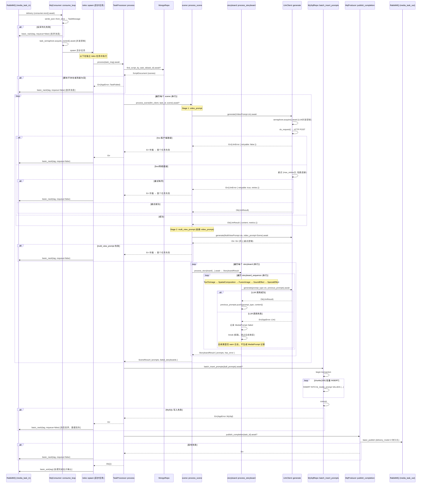

# Media Prompt 生成微服务 — 深度代码分析

---

## 一、异步处理链路分析

### 1.1 完整链路 Mermaid 时序图



### 1.2 链路关键 await 点与错误处理策略汇总

| 步骤 | async 函数 | await 位置 | 错误处理策略 |
|------|-----------|-----------|-------------|
| 消息反序列化 | `serde_json::from_slice` (同步) | N/A | NACK + `requeue=false`（丢弃） |
| 信号量获取 | `Semaphore::acquire_owned` | consumer.rs:193 | 关闭时退出循环或触发重连 |
| MongoDB 查询 | `MongoRepo::find_script_by_task_id` | processor.rs:46 | `?` 传播 → 任务失败 → NACK |
| 场景级 video_prompt | `LlmClient::generate` | scene.rs:48 | `?` 传播 → 整个任务失败 → NACK |
| 场景级 multi_view_prompt | `LlmClient::generate` | scene.rs:82 | `?` 传播 → 整个任务失败 → NACK |
| 分镜级各类提示词 | `LlmClient::generate` | storyboard.rs:52 | 记录 failed + break 短路（不传播） |
| MySQL 批量写入 | `MySqlRepo::batch_insert_prompts` | processor.rs:79 | `?` 传播 → 任务失败 → NACK |
| 下游消息发布 | `MqProducer::publish_completion` | processor.rs:89 | `?` 传播 → 任务失败 → NACK |
| LLM HTTP 请求 | `LlmClient::do_request` | client.rs:177 | 4xx 不重试；5xx/网络错误指数退避重试最多 `max_retries` 次 |
| RabbitMQ 重连 | `MqConsumer::connect_and_consume` | consumer.rs:56 | 指数退避重连（上限 30s），支持优雅关闭 |

---

## 二、提示词依赖顺序分析

### 2.1 依赖关系实现方式：串行管道（Serial Pipeline）

当前系统采用**严格串行管道**模式，而非 DAG 或并行管道。具体体现在两个层级：

**场景级（scene-level）— 硬依赖，失败即终止：**

```
VideoPrompt ──→ MultiViewPrompt
   (独立)         (依赖 VideoPrompt 内容)
```

代码依据（[scene.rs](backend/src/task/scene.rs)）：
- VideoPrompt 的结果 `video_prompt_content` 作为 `PromptContext.video_prompt` 传入 MultiViewPrompt 的生成上下文
- 两者均使用 `?` 传播错误，任一失败则整个 `process_scene` 返回 `Err`

**分镜级（storyboard-level）— 软依赖，失败则短路：**

```
TextToImage ──→ SpatialCompositionDrawing ──→ FusionImage
                                                    ↓
                                              (与下方并行？否，串行)
                                 SoundEffect ──→ SpecialEffect
```

实际执行顺序由 `PromptType::storyboard_sequence()` 定义（[prompt.rs:31-39](backend/src/model/prompt.rs#L31-39)）：

```rust
&[
    Self::TextToImage,
    Self::SpatialCompositionDrawing,
    Self::FusionImage,
    Self::SoundEffect,
    Self::SpecialEffect,
]
```

代码依据（[storyboard.rs](backend/src/task/storyboard.rs)）：
- 每个类型生成后，结果被推入 `previous_prompts: Vec<(PromptType, String)>`
- 后续类型通过 `PromptContext::get_previous(pt)` 查找前序结果
- `build_system_prompt()` 中各类型的实际依赖关系：
  - **TextToImage**：依赖 `video_prompt` + `multi_view_prompt` + `storyboard_content`
  - **SpatialCompositionDrawing**：依赖 `video_prompt` + `multi_view_prompt` + **TextToImage** + `storyboard_content`
  - **FusionImage**：依赖 `video_prompt` + `multi_view_prompt` + **TextToImage** + **SpatialCompositionDrawing** + `storyboard_content`
  - **SoundEffect**：仅依赖 `video_prompt` + `storyboard_content`（不依赖视觉提示词链）
  - **SpecialEffect**：仅依赖 `video_prompt` + `storyboard_content`（不依赖视觉提示词链）

### 2.2 某类提示词生成失败时对后续类型的影响

**场景级失败（video_prompt / multi_view_prompt）：**
- 直接通过 `?` 传播错误，导致 `process_scene` 返回 `Err`
- 进而导致 `TaskProcessor::process` 返回 `Err`
- 最终消息被 NACK（`requeue=false`），**整个任务的所有提示词全部丢失**

**分镜级失败（storyboard-level）：**

| 失败类型 | 受影响的后续类型 | 不受影响但被跳过的类型 |
|---------|---------------|-------------------|
| TextToImage | SpatialCompositionDrawing、FusionImage（逻辑依赖） | SoundEffect、SpecialEffect（无逻辑依赖，但被串行短路跳过） |
| SpatialCompositionDrawing | FusionImage（逻辑依赖） | SoundEffect、SpecialEffect（无逻辑依赖，但被串行短路跳过） |
| FusionImage | 无（逻辑依赖链到此结束） | SoundEffect、SpecialEffect（无逻辑依赖，但被串行短路跳过） |
| SoundEffect | SpecialEffect（无逻辑依赖，但串行排在后面） | 无 |
| SpecialEffect | 无后续类型 | 无 |

**关键问题：SoundEffect 和 SpecialEffect 在逻辑上不依赖 TextToImage → FusionImage 这条视觉链，但由于 `storyboard_sequence()` 将它们排在 FusionImage 之后，一旦视觉链中任何一环失败，SoundEffect 和 SpecialEffect 也会被短路跳过，即使它们完全可以独立生成。**

### 2.3 当前设计的优缺点

| 维度 | 优点 | 缺点 |
|------|------|------|
| **实现复杂度** | 串行管道实现简单，代码可读性高，调试容易 | 无法表达类型间的真实依赖关系（DAG） |
| **一致性保证** | `previous_prompts` 保证了上下文传递的顺序性 | 过度串行化导致不必要的等待 |
| **错误隔离** | 场景级失败快速终止，避免无效计算 | 分镜级短路过于激进，无逻辑依赖的类型也被跳过 |
| **性能** | 无并发竞争问题 | 无法并行生成无依赖关系的类型（如 SoundEffect 和 TextToImage） |
| **可恢复性** | 失败的提示词有完整的错误记录（`MediaPrompt::failed`） | 被跳过的类型无任何记录（仅 warn 日志），下游无法区分"未生成"和"生成失败" |
| **扩展性** | 新增类型只需修改 `storyboard_sequence()` | 修改依赖关系需要理解整个串行链路，容易引入回归 |

---

## 三、可靠性风险分析

### 3.1 (a) RabbitMQ 消息确认时机

**当前实现：处理完成后 ACK（正确方向，但存在边界风险）**

代码依据（[consumer.rs:214-229](backend/src/mq/consumer.rs#L214-229)）：

```rust
match processor.process(task_msg).await {
    Ok(()) => {
        ch.basic_ack(tag, BasicAckOptions::default()).await;
    }
    Err(e) => {
        ch.basic_nack(tag, BasicNackOptions { requeue: false, ..Default::default() }).await;
    }
}
```

**风险分析：**

1. **ACK 在 spawned 任务中执行，存在连接丢失导致重复处理的风险**
   - **根因**：消息处理和 ACK 发送在同一个 spawned 任务中。如果 RabbitMQ 连接在 MySQL 写入成功后、ACK 发送前断开，则：
     - MySQL 中已有数据
     - RabbitMQ 未收到 ACK，消息将被重新投递
     - 重新投递后再次处理，导致 `tb_media_prompt` 中出现重复行
   - **当前无防护**：`tb_media_prompt` 表没有 `(task_id, scene_index, storyboard_index, prompt_type)` 的唯一约束（[schema.sql](backend/sql/schema.sql) 中仅有 `idx_task_id` 和 `idx_task_scene` 两个普通索引）

2. **NACK 使用 `requeue=false` 但未配置死信队列（DLX）**
   - **根因**：`queue_declare` 时未设置 `x-dead-letter-exchange` 参数（[consumer.rs:101-109](backend/src/mq/consumer.rs#L101-109)），NACK 后消息直接丢弃
   - 任何处理失败的消息（包括临时性错误如 MySQL 短暂不可用）都无法恢复
   - 没有重试队列机制，无法对失败消息进行人工干预或延迟重试

3. **prefetch_count 与并发任务数的不匹配**
   - `prefetch_count = 10`，`max_tasks = 5`，信号量控制最多 5 个并发任务
   - 但 RabbitMQ 会在 ACK 前持续推送消息，可能导致大量消息堆积在客户端内存中

**改进方案：**

- 为 `tb_media_prompt` 添加唯一约束：`UNIQUE KEY uk_prompt (task_id, scene_index, storyboard_index, prompt_type)`，并在 `batch_insert_prompts` 中使用 `INSERT ... ON DUPLICATE KEY UPDATE` 实现幂等写入
- 为消费队列配置 DLX：`x-dead-letter-exchange` + `x-dead-letter-routing-key`，使 NACK 的消息进入死信队列供后续排查或重试
- 考虑引入重试队列 + TTL 机制：对可重试错误 NACK 到重试队列（带 TTL），而非直接丢弃
- 将 `prefetch_count` 调整为与 `max_tasks` 一致或略高，避免过多未确认消息堆积

### 3.2 (b) LLM API 调用超时和重试策略

**当前实现：**

代码依据（[client.rs:29-32](backend/src/llm/client.rs#L29-32)、[client.rs:64-148](backend/src/llm/client.rs#L64-148)）：

- 超时：`Client::builder().timeout(Duration::from_secs(config.timeout_secs))`，默认 120s
- 重试：最多 `max_retries`（默认 3）次，指数退避 `1000ms * 2^(attempt-1)`（即 1s, 2s, 4s）
- 4xx 不重试，5xx / 网络错误重试

**风险分析：**

1. **HTTP 429 (Rate Limit) 被错误地归类为不可重试**
   - **根因**：[client.rs:203-210](backend/src/llm/client.rs#L203-210) 中 `status >= 400 && status < 500` 统一返回 `LlmError::non_retryable`
   - 429 是服务端限流，语义上属于可重试错误，且应使用更长的退避时间（通常建议遵循 `Retry-After` 头）
   - 当前实现下，遇到 429 直接放弃，导致本可成功的提示词生成被标记为失败

2. **超时时间涵盖整个 HTTP 生命周期**
   - **根因**：`reqwest::Client::timeout()` 包含连接 + 请求发送 + 响应接收的全过程
   - 对于 LLM 长文本生成（尤其是 video_prompt 等复杂提示词），120s 可能不够
   - 但对于简单类型（如 SoundEffect），120s 又过长，失败检测延迟大
   - 无法针对不同 `prompt_type` 设置差异化超时

3. **退避策略不够精细**
   - 初始退避 1s 对 429 限流场景过短（LLM API 通常需要 5-30s 的冷却期）
   - 没有抖动（jitter），多任务并发重试时可能产生"惊群"效应
   - 最大退避无上限控制（`2^2 = 4s`，3 次重试时最大 4s，尚可接受）

4. **空响应内容仅 warn 不视为错误**
   - **根因**：[client.rs:83-91](backend/src/llm/client.rs#L83-91) 中 `content.trim().is_empty()` 仅打印 warn 日志，仍返回 `Ok(LlmResult)`
   - 空内容的提示词写入 MySQL 后，下游系统无法区分"LLM 返回了空字符串"和"成功生成了内容"

**改进方案：**

- 将 429 从 4xx 分支中独立出来，作为可重试错误处理，并解析 `Retry-After` 响应头作为退避时间
- 为不同 `prompt_type` 支持差异化超时配置（如 video_prompt 180s，sound_effect 60s）
- 在退避计算中加入随机抖动：`backoff = base_delay * 2^attempt + random(0, base_delay)`
- 对空响应内容返回 `Err` 或至少标记为 `PromptStatus::Failed`，而非静默通过
- 考虑引入断路器模式（circuit breaker），在连续失败率达到阈值时暂停调用，避免无效重试浪费资源

### 3.3 (c) MySQL 写入失败时的消息丢失与重复处理

**当前实现：**

代码依据（[mysql.rs:31-92](backend/src/db/mysql.rs#L31-92)、[processor.rs:79-85](backend/src/task/processor.rs#L79-85)）：

- 使用事务批量写入，每 100 条一个 chunk INSERT
- 写入失败时 `?` 传播错误，最终 NACK 消息

**风险分析：**

1. **MySQL 写入失败 → 消息被 NACK(requeue=false) → 数据永久丢失**
   - **根因**：[processor.rs:79-85](backend/src/task/processor.rs#L79-85) 中 MySQL 错误直接传播，[consumer.rs:222-228](backend/src/mq/consumer.rs#L222-228) 中 NACK 不重入队
   - MySQL 临时性故障（如连接超时、死锁、主从切换）会导致已成功生成的所有提示词丢失
   - 重新投递也无法恢复（因为 `requeue=false`）

2. **MySQL 写入成功但 ACK 失败 → 重复处理**
   - **根因**：ACK 发送是在 MySQL 写入之后的独立网络操作
   - 如果 ACK 发送时 RabbitMQ 连接已断开，消息将被重新投递
   - 重新处理会再次写入 MySQL，由于缺少唯一约束，产生重复数据
   - 重复数据会导致下游系统重复消费

3. **批量写入的事务粒度过大**
   - **根因**：所有场景、所有分镜的提示词在一个事务中写入
   - 如果一个包含 10 个场景 × 5 个分镜 × 7 个提示词 = 350 条记录的任务，其中最后一条因数据问题（如字段超长）导致 INSERT 失败，整个事务回滚，前 349 条成功生成的提示词也全部丢失
   - 没有部分成功的机制

4. **publish_completion 与 MySQL 写入的非原子性**
   - **根因**：MySQL 写入成功后，如果 `publish_completion` 失败，消息被 NACK
   - 重新投递后会重新执行整个处理流程（包括 LLM 调用和 MySQL 写入），造成资源浪费和数据重复
   - 如果 `publish_completion` 成功但 ACK 失败，下游系统会收到两次完成通知

**改进方案：**

- **幂等性保障**：为 `tb_media_prompt` 添加唯一约束 `(task_id, scene_index, storyboard_index, prompt_type)`，使用 `INSERT ... ON DUPLICATE KEY UPDATE` 或 `INSERT IGNORE` 实现幂等写入
- **可重试错误与不可重试错误分离**：MySQL 临时性故障（连接超时、死锁）应 NACK 并 `requeue=true` 或推入重试队列；数据完整性错误（字段超长、约束冲突）才应 `requeue=false`
- **分场景写入**：将批量写入拆分为按场景提交事务，降低单次事务失败的影响范围
- **引入任务状态表**：在 MySQL 中增加 `tb_task_status` 表记录任务处理进度（如 `prompt_generated`、`mysql_written`、`completion_published`），重新投递时可根据状态跳过已完成步骤
- **publish_completion 幂等**：下游消费者应对同一 task_id 的完成消息做去重处理
